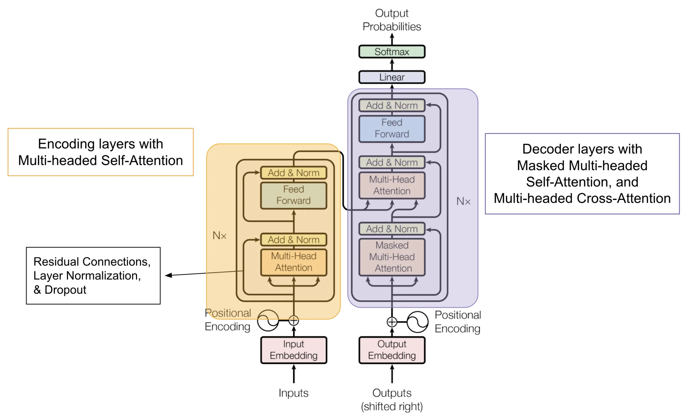
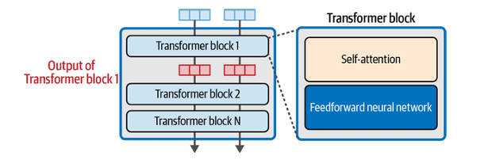
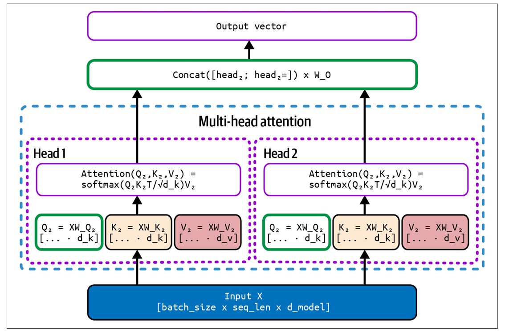
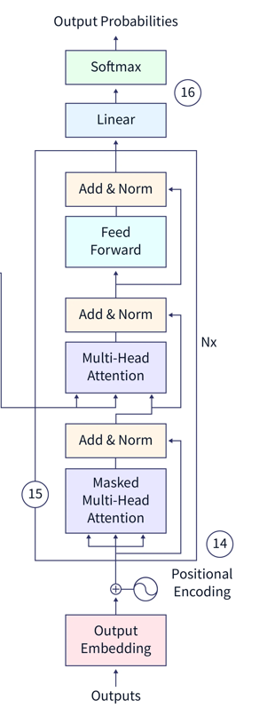

# 🧠 Lifecycle of Training and Adapting Large Language Models (LLMs)

Modern LLMs undergo multiple stages of training and refinement to become capable, helpful, and aligned with human expectations. These stages include **pretraining**, **finetuning**, and **post-training augmentation**.

---

## 🚀 1. Pretraining

- The initial stage, known as **pretraining**, creates a `base` or `foundation model`.
- The model is trained on massive text corpora using **self-supervised learning**, typically by predicting the next word in a sequence.
- Common techniques:
    - **Causal Language Modeling** (e.g., GPT-style)
    - **Masked Language Modeling** (e.g., BERT-style)

> 📌 Pretraining equips the model with broad language understanding but not task-specific behavior.

---

## 🧩 2. Finetuning

After pretraining, the model is adapted to specific tasks using labeled data.

### ✳️ Popular Finetuning Strategies:

#### 🔹 **Instruction Finetuning**
- Uses datasets of **instruction–response pairs**.
- Trains the model to follow human instructions across diverse tasks.
- Example: `"Translate this sentence"` → `"Voici la traduction."`

#### 🔹 **Classification Finetuning**
- Uses labeled datasets for tasks like spam detection, sentiment analysis, etc.
- Example: `"Email text"` → `"Spam"` or `"Not Spam"`

---

## 🔧 3. Post-Training Augmentation

To further align models with human needs and domain-specific tasks, model providers apply additional tuning techniques:

### 🔹 **Supervised Instruction Fine-Tuning (SFT)**
- Refines the model using curated instruction–response datasets.
- Improves the model’s ability to follow instructions accurately and consistently.
- Often used to create **instruct models**.

### 🔹 **Reinforcement Learning from Human Feedback (RLHF)**
- Trains a **reward model** based on human preferences (e.g., ranking outputs).
- Uses reinforcement learning (e.g., PPO) to optimize the model toward preferred responses.
- Enhances helpfulness, safety, and alignment.
- Key to building **chat models** like ChatGPT.

### 🔹 **Domain-Adaptive or Task-Adaptive Continued Pretraining**
- Further pretrains the model on **domain-specific** or **task-specific** unlabeled data.
- Improves performance in specialized areas (e.g., biomedical, legal, finance).
- Techniques include:
    - **DAPT**: Domain-Adaptive Pretraining
    - **TAPT**: Task-Adaptive Pretraining

---

## 🧪 Resulting Model Types

Depending on the augmentation strategy, models are categorized as:

| Model Type       | Description                                   |
| ---------------- | --------------------------------------------- |
| `Base Model`     | Pretrained on general text; not task-specific |
| `Instruct Model` | Tuned via SFT to follow instructions          |
| `Chat Model`     | Tuned via RLHF for conversational alignment   |
| `Domain Model`   | Adapted via DAPT/TAPT for specialized domains |

---

## 🛠️ Additional Techniques

- **Parameter-Efficient Finetuning (PEFT)**: Methods like **`LoRA` or `QLoRA`** allow tuning with fewer resources.
- **Prompt Tuning**: Adjusts prompts rather than model weights.
- **Direct Preference Optimization (DPO)**: An alternative to **`RLHF`** using chosen/rejected pairs.

---

## 📚 Summary

Training an LLM is a multi-phase journey:

1. **Pretraining** → General language understanding
2. **Finetuning** → Task-specific adaptation
3. **Augmentation** → Human alignment, domain specialization, and instruction-following

These stages transform raw models into powerful assistants, chatbots, and domain experts.

# 🧹 Training Data Preprocessing

In Large Language Model (LLM) development, preprocessing is a foundational step. After collecting or procuring raw data, it undergoes a filtration and cleaning pipeline to ensure high-quality inputs for training. Well-designed preprocessing significantly improves model performance downstream.

---

## 🧪 Data Filtering and Cleaning

### 🔍 Common Issues in Raw HTML Data

Most raw data is extracted from HTML pages, which often contain:
- Boilerplate content (headers, menus, footers)
- Advertisements and navigation elements
- Pornographic or toxic language
- Non-English or low-quality content

Cleaning these artifacts is essential to preserve signal and eliminate noise.

### 🧰 Extracting Clean Text Using `jusText`

Here's an example using the `jusText` library to remove boilerplate text from a web page:

```python
# !pip install justext
import requests
import justext

response = requests.get("https://en.wikipedia.org/wiki/Toronto_Transit_Commission")
paragraphs = justext.justext(response.content, justext.get_stoplist("English"))

for content in paragraphs:
  if not content.is_boilerplate:
    print(content.text)
```
Some alternative libraries used for this task include `Dragnet`, `html2text`, `inscriptis`, `Newspaper`, and `Trafilatura`.

HTML pages also contains images, math formulas, code blocks, tables and removing them or not is a question of how you want to approach
for example **Meta** retains the `alt` attribute in images, which it found contains useful information like math content.

Once text is extracted, a series of filtration steps follow:
- 🚫 Remove boilerplate content 
- 🔞 Eliminate pornographic or explicit material 
- 🌐 Filter non-English content 
- 🤬 Remove toxic or hateful language 
- 🔁 Deduplicate documents 
- 📊 Score documents for quality 
- 🏷️ Extract metadata for document provenance

## 📚 Selecting High-Quality Documents

Document quality plays a pivotal role in training effective language models. High-quality sources—such as educational or encyclopedic texts—are preferred over promotional, noisy, or low-value data.

---

## 🧠 Techniques for Quality Selection

### 1. Token Distribution Filtering via K-L Divergence
- **Purpose**: Remove documents with token usage that significantly deviates from a reference distribution.
- **Method**: Compute **Kullback-Leibler (K-L) divergence** between the document's token distribution and a trusted reference (e.g., Wikipedia corpus).
- **Outcome**: Filters out documents filled with outlier or domain-specific tokens.
- **Formula (K-L Divergence)** :
  $$ D_{KL}(P || Q) = \sum_i P(i) \log \frac{P(i)}{Q(i)} $$
  Where:
    - *P(i)*: Probability distribution of tokens in the document
    - *Q(i)*: Reference token distribution


### 2. Classifier-Based Document Filtering
- **Approach**: Train a binary classifier to distinguish between high- and low-quality text.
- **Training Strategy**:
  - *Positive Class*: Curated sources like Wikipedia.
  - *Negative Class*: Raw web data from sources like Common Crawl.
- **Use Case**: Enables scalable filtering across large, heterogeneous datasets.


### 3. Language Model Perplexity Scoring
- **Definition**: Perplexity evaluates how well a language model predicts the next token in a sequence.
- **Usage**: Assigns a quality score to each document. Lower perplexity suggests better predictability and coherence.
- **Formula**:
  $$ \text{Perplexity}(D) = \exp\left(-\frac{1}{N} \sum_{i=1}^{N} \log P(w_i) \right) $$
  Where:
  - *N*: Total number of tokens in document *D*
  - *P(w_i)*: Model-assigned probability of token *w_i*

> ✅ High-quality documents typically yield **low perplexity**, indicating alignment with the model’s learned distribution.


## 🧹 Deduplication in Text Corpora

Duplicate data is common in web-crawled corpora and can introduce undesirable biases during language model training. Deduplication helps improve data diversity and learning efficiency.

---

### 🔍 Types of Duplicate Matches

1. **Exact Matches**
   - Sequences that are **identical character-by-character**.
   - Fully redundant and should be removed.

2. **Approximate Matches**
   - Sequences are **mostly identical**, with **minor character-level differences**.
   - Example: Typos, punctuation changes, casing differences.

3. **Semantic Matches**
   - Sequences convey **the same meaning** using **different wording**.
   - Often treated as **non-duplicates**, as they enhance contextual variety in training.

> 💡 Semantic duplicates are valuable—they improve model generalization by exposing it to varied expressions of the same idea.


### 🔬 Granularity of Deduplication

#### 📄 Document-Level Deduplication
- Detect and remove documents that convey **substantially the same content**.
- Useful when entire articles or pages are repeated across sources.

#### ✂️ Sequence-Level Deduplication
- Detect repeated **lines, paragraphs, or sentences** within or across documents.
- Often caused by templated formats, disclaimers, or boilerplate content.


### 📚 Summary

Effective deduplication targets exact and approximate redundancies while preserving semantic diversity. Applying it across multiple levels of granularity ensures cleaner, more efficient training datasets without sacrificing contextual depth.

---

## 🛡️ Removing Personally Identifiable Information (PII) from Training Data

While deduplication reduces redundant content, it does not eliminate the risk of memorization. Even information appearing **once** in a dataset may be memorized and leaked by a model—posing critical privacy concerns.

---

### 🔍 What Is PII?

**Personally Identifiable Information (PII)** is data that can identify an individual, alone or when combined with other info.

- **Examples:** Name, address, email, phone, credit card, medical history, geolocation
- **Contextual Risk:** Non-PII can become PII when paired with public data
- **Jurisdictional Definitions:** GDPR includes identity traits (Physical, physiological, genetic, mental, commercial, cultural, or social identity.)

### 🛡️ PII Detection
PII detection shares similarities with Named Entity Recognition (NER), but not all named entities qualify as PII. Rigorous identification and validation are required to safeguard sensitive data during model training.


Defined PII entity types include:

- `PERSON`
- `AGE`
- `NORP` (Nationality, Race, Religion, Political Party, Socio-economic Class, Union Membership)
- `STREET_ADDRESS`
- `CREDIT_CARD`
- `GOVT_ID`
- `EMAIL_ADDRESS`
- `USER_ID`
- `PUBLIC_FIGURE` (includes real and fictional characters; excluded from filtering)

> Cultural nuances affect annotation consistency—highlighting challenges in defining privacy boundaries across regions.

---

### 🧪 PII Detection Techniques

1. 🔤 **Regular Expressions for Structured PII**
    ```python
    #  SSN (US Social Security Numbers)
    ssn_pattern = r"(?!000|666|333)0*(?:[0-6][0-9][0-9]|[0-7][0-6][0-9]|[0-7][0-7][0-2])[-\ ](?!00)[0-9]{2}[-\ ](?!0000)[0-9]{4}"
    
    #  Email Pattern
    email_pattern = r"[\w\.=-]+ @ [\w\.-]+ \. [\w]{2,3}"
   
    # also we can write pattern for detecting credit card number
    ```
2. **Transformer-based model for PII detection and remediation**
    - we can train a model with dataset having PII tags and use it further for identification and remediation 
    - Once PII has been detected, it can be remediated.

we can replace a valid phone number string with `<phone_number>` tag, valid email with `<email>` tag

---

---


# 🧠 Tokenization in LLM Training

Tokenization is a core component in training Large Language Models (LLMs). Since neural networks operate on numerical data, we must first convert raw text into a numerical format—typically through the process of tokenization. This transformation ensures text is broken down into meaningful units (tokens) that can be embedded and processed efficiently.

---

## 🧬 Embedding Context

Before diving into tokenization, it's helpful to understand **embedding**—the process of converting tokens into contextual, multi-dimensional vectors. These vectors capture semantic and syntactic information, enabling neural networks to reason about language in a meaningful way.

---

## 🔄 Tokenization Pipeline Overview

Tokenization is a multi-stage process consisting of four major components:

1. **Normalization**
2. **Pre-tokenization**
3. **Tokenization**
4. **Postprocessing**

Each stage may vary depending on the tokenizer architecture and the goals of the model (e.g., general-purpose vs. code-specific, multilingual vs. English-only).

---

## 🔧 1. Normalization

Normalization ensures consistency and removes linguistic noise. Typical steps include:
- 🔡 Lowercasing text: e.g., `"Apple"` → `"apple"`
- 🔤 Accent removal: e.g., `"Peña"` → `"Pena"`
- ⚙️ Unicode normalization: Standardizing character encoding formats (NFC/NFD)

---

## ✂️ 2. Pre-tokenization

Pre-tokenization splits raw text into preliminary word-like segments before vocabulary matching.

- 📚 Example: Using Hugging Face’s regular expression `\w+|[^\w\s]+` separates text into words and punctuation.
- 🧠 Helps prevent ambiguity during actual token generation.

---

## 🧠 3. Tokenization

This is the heart of the tokenizer where raw segments are mapped to vocabulary indexes using learned rules or models. Popular algorithms include:

| Algorithm                | Description                                                                |
| ------------------------ | -------------------------------------------------------------------------- |
| Byte Pair Encoding (BPE) | Iteratively merges frequent symbol pairs to form subwords                  |
| Byte-level BPE           | Operates directly on bytes, allowing any Unicode character to be tokenized |
| WordPiece                | Used in BERT; splits words into subword units based on probability         |
| Unigram Language Model   | Probabilistically selects tokenization based on a trained language model   |

- 🔍 During this stage, a vocabulary is built that assigns a unique ID to each token.

---

## 🧩 4. Postprocessing

Adds model-specific or auxiliary tokens for training and inference. These may include:
- `UNK` : Unknown or out-of-vocabulary token                        
- `PAD` : Padding token (used when input is shorter than max length) 
- `EOS` : End of a sequence                                           
- `<|endoftext|>` : Separator between documents                            
- `<s>` / `</s>` : Start/end of sentence markers                           
- `CLS` / `SEP` : Used in models like BERT for classification tasks        

These tokens enable models to understand structure and task boundaries during training.

---

## 🚀 Additional Concepts

### 🔢 Token IDs and Embedding Lookup
Once text is tokenized, tokens are converted to **token IDs**, which are integers indexed in the model's vocabulary. These IDs are then passed to the embedding layer to fetch their corresponding vector representation.

### 🌍 Multilingual Tokenization
For multilingual models like mBERT or XLM-R, special preprocessing may include:
- Language-specific normalization
- Shared subword vocabularies across languages
- Language ID tokens to guide encoding

### 📏 Sequence Length and Truncation
Most models have a **maximum sequence length** (e.g. 512 or 2048 tokens). Longer sequences are truncated or split, while shorter ones are padded.

### 🎛️ Special Tokenizer Settings
Tokenizers may be configured for:
- Lowercasing or case-sensitive tokenization
- Strip accents toggle
- Padding strategies: left-padding vs. right-padding
- Truncation modes: longest-first vs. only-first

---

## ✅ Summary

Tokenization converts raw text into structured, numeric data that LLMs can ingest and learn from. A well-designed tokenizer balances vocabulary efficiency, semantic coverage, and training compatibility. Understanding this pipeline helps you better utilize and fine-tune models for NLP tasks.

---
## Tokenization Algorithms


### 🔠 Byte Pair Encoding (BPE) Algorithm

Byte Pair Encoding (BPE) is one of the most widely used subword tokenization algorithms in training 
language models. It incrementally builds a vocabulary by merging frequently co-occurring characters or 
character pairs, enabling compact and efficient representation of language.

The BPE algorithm follows these core steps:

1. **Initialize Vocabulary** — Start with a vocabulary of unique characters from the dataset.
2. **Pair Frequency Counting** — Identify all adjacent token pairs and count their frequencies.
3. **Merge Most Frequent Pairs** — Replace the most frequent pair with a new merged token.
4. **Update Vocabulary & Tokens** — Add the new token to the vocabulary and update the input token list.
5. **Repeat** — Continue steps 2–4 until a desired vocabulary size is reached.

---

📚 Example

Our dataset is this : `['bat', 'cat', 'cap', 'sap', 'map', 'fan']`

Input is like this : `['b','a', 't', 'c', 'a', 't', 'c', 'a', 'p', 's', 'a', 'p', 'm', 'a', 'p', 'f', 'a', 'p']`

**Steps**
1. Create Initial Vocabulary of unique characters
    ```python
    dataset = ['b','a', 't', 'c', 'a', 't', 'c', 'a', 'p', 's', 'a', 'p', 'm', 'a', 'p', 'f', 'a', 'p']
    
    initial_vocab = {'b' : 1, 'a': 2, 't': 3, 'c': 4, 'p': 5, 's': 6, 'm': 7, 'f': 8, 'n': 9}
    ```
2. Create Freq Table for Adjacent tokens 
    ```python
    freq_table = {'ba' : 1, 'at' : 2, 'ca' : 2, 'ap' : 3, 'sa' : 1, 'ma' : 1, 'fa' : 1, 'an':1}
   # selecting most frequent pair out of it => 'ap'
    ```
3. Merge frequent pair and update vocabulary
    ```python
    dataset = ['b','a', 't', 'c', 'a', 't', 'c', 'ap', 's', 'a', 'p', 'm', 'ap', 'f', 'ap']
    initial_vocab = {'b' : 1, 'a': 2, 't': 3, 'c': 4, 'p': 5, 's': 6, 'm': 7, 'f': 8, 'n': 9, 'ap': 10}
    ```
Repeat this process until the desired size of vocabulary is reached


# The Transformer Architecture

The Transformer is a deep learning model introduced in the landmark 2017 paper *"Attention Is All You Need."* This architecture revolutionized natural language processing (NLP) by moving away from recurrent neural networks (RNNs) and becoming the foundation for most modern large language models (LLMs) like GPT, BERT, and T5. Its key innovation is the use of the self-attention mechanism, which processes all words in a sequence simultaneously.

## 🧠 High-Level Diagram




The original Transformer model is a classic **Encoder-Decoder** architecture, as shown in the diagram below.

This architecture consists of:

* **Encoder Stack**: The encoder is responsible for processing the input sequence and creating a contextual representation of each word. It processes all input tokens at once.

* **Decoder Stack**: The decoder takes the encoder's output and generates the target output sequence, one token at a time.

Each of these stacks is composed of multiple identical layers. Each layer contains two primary sub-layers: a **multi-head self-attention mechanism** and a **position-wise feed-forward network**.

## 🔍 Core Components of a Transformer

### A. Positional Encoding

Since the Transformer processes tokens in parallel without any recurrence, it has no inherent sense of word order. 
To solve this, **positional encoding** is added to the input embeddings. 
This is a vector of fixed values that encodes the position of each token in the sequence. 
It's essentially a special signal that tells the model where each word is located.

### B. Transformer Block
It is made up of two successive components:



1. **Self-Attention** : The attention layer is mainly concerned with incorporating relevant information from other input tokens and positions
2. **Feed-Forward Network** : The feedforward layer houses the majority of the model’s processing capacity

#### **`Self-Attention`**
Self-attention is the heart of the Transformer. It allows the model to weigh the importance of different words in the input sequence when encoding a specific word. 

📌 Example
Consider the sentence:
  > "The animal didn't cross the street because it was too tired."

To understand what "it" refers to, the model must consider the entire sentence. Self-attention helps the model assign higher importance (attention weights) to "the animal" when processing "it," enabling correct interpretation.


**⚙️ How It Works** :

Each token is represented by its embedding vector. This vector is multiplied with the query, key, and value weight matrices to generate three input vectors. Self-attention

for each token is then calculated like this:
1. For each token, the dot products of its query vector with the key vectors of all the tokens (including itself) are taken. The resulting values are called attention scores.
2. The scores are scaled down by dividing them by the square root of the dimension of the key vectors.
3. The scores are then passed through a softmax function to turn them into a probability distribution that sums to 1. The softmax activation function tends to amplify larger values, hence the reason for scaling down the attention scores in
 the previous step.
4. The normalized attention scores are then multiplied by the value vector for the corresponding token. The normalized attention score can be interpreted as the proportion that each token contributes to the representation of a given token.
5. In practice, there are multiple sets of query, key, and value vectors, calculating parallel representations. This is called multi-headed attention. The idea behind using multiple heads is that the model gets sufficient capacity to model various aspects of the input. The more the number of heads, the more chances that then right aspects of the input are being represented.




#### **`Feed-Forward Network`**
After the attention mechanism, each encoder and decoder layer contains a simple, position-wise fully connected 
feed-forward network. This network consists of two linear transformations with a ReLU activation in between. 
It processes each position of the sequence independently.

### C. Multi-Head Attention

Instead of using a single attention function, the Transformer uses "multi-head" attention. This means it splits the Queries, Keys, and Values into multiple "heads" and performs the attention calculation for each head independently and in parallel. This allows the model to attend to different parts of the input sequence simultaneously, capturing various relationships and nuances. The outputs from all heads are then concatenated and passed through a linear layer.

## How self attention is calculated

The scaled dot-product attention formula is:

$$\text{Attention}(Q, K, V) = \text{softmax}\left(\frac{QK^T}{\sqrt{d_k}}\right)V$$

* **$\sqrt{d_k}$** : A scaling factor to prevent the dot product from growing too large.

Imagine that there is a table in a database with keys and values column, where keys are names of employee and say values are their salaries.

| key (K) | value (V) |
| ------- | --------- |
| jon     | 2000      |
| john    | 2400      |
| joan    | 4000      |
| june    | 1500      |
| jane    | 3000      |

Now you can employees which names are like `jo`, So then you query will be like this
> Q = Key LIKE 'jon'

so, now your query will execute against each row in the table and ranks table according to the similarity with the key.
When you multiply Query and Key, you will get similarity score and we will get result back where score is equal to `1` 

| key (K) | value (V) | similarity |
| ------- | --------- | ---------- |
| jon     | 2000      | 1          |
| june    | 1500      | 0          |
| jane    | 3000      | 0          |

now there is 100 percent match with `jon` so we get value as `2000`, if there are 2 jon then we will get 2 values.

let say we query and there are two keys like this `jon`, `john`, `joan` and we get similarity score like this

| key (K) | value (V) | similarity |
| ------- | --------- | ---------- |
| jon     | 2000      | 1          |
| john    | 2500      | 0.6        |
| joan    | 1000      | 0.5        |

so, now we have 3 values but they are unscaled and summation of their similarity does not adds to 1. 
Hence we will apply softmax function over them and get the probabilities score or similarity score between 0 to 1.

Softmax formula for a score s_i:
$$\text{Softmax}(s_i) = \frac{e^{s_i}}{\sum_{j} e^{s_j}}$$

- `jon` = ${e^1}/({e^1 + e^{0.6} + e^{0.5}})$ = 2.71 / 6.1891 = 0.4392  
- `john` = ${e^{0.6}}/({e^1 + e^{0.6} + e^{0.5}})$ = 1.8221/6.1891= 0.2944
- `joan` = ${e^{0.5}}/({e^1 + e^{0.6} + e^{0.5}})$ = 1.6467 / 6.1891 = 0.2663

now, we will calculate weighted sum for the Query (Q) by multiplying Value (V) with Similarity (KQ) 
 $$(0.4392 * 2000) + (0.2944 * 2500) + (0.2663 * 1000) = 1880.7$$

We have done this only for 1 query, In the transformer we do this for all the tokens.
first step in the calculating self-attention is to create Query (Q), Key (K) and Value (V) vector for each token embedding in the sentence. These vectors are created by multiplying the embedding by three matrices that we trained during the training process.

So, let say that our 
- context_length = `Nx`, embedding_dimension = `dim` ----> input to transformer block will be of size `(Nx * dim)`
- Then calculate K,V,Q matrices for the given input by multiplying it with $W_q, W_k, W_v$ like below
  - $Q = X * W_q$ ------->  ($N_x$, dim) * (dim, dim) = ($N_x$, dim)
  - $K = X * W_k$ ------->  ($N_x$, dim) * (dim, dim) = ($N_x$, dim)
  - $V = X * W_v$ ------->  ($N_x$, dim) * (dim, dim) = ($N_x$, dim)

  Here, $W_q, W_k, W_v$ are all of size `(dim, dim)`

- Then calculate scaled dot product by multiplying Q and K 
  - ${QK^T}$ -------> ($N_x$, dim) * (dim, $N_x$) = ($N_x$, $N_x$)
  - scale above result by dividing it with ${\sqrt{d_k}}$
  - apply softmax over it ---> $\text{softmax}\left(\frac{QK^T}{\sqrt{d_k}}\right)$
- multiply it with V
  - $\text{softmax}\left(\frac{QK^T}{\sqrt{d_k}}\right)$ * V   -------> ($N_x$, $N_x$) * ($N_x$, dim) = ($N_x$, dim)

Finally we get the self-attention, 

$\text{Attention}(Q, K, V) = \text{softmax}\left(\frac{QK^T}{\sqrt{d_k}}\right)V$

This is how self attention  is implemented  : 

```py
import torch
import torch.nn as nn
import torch.nn.functional as F

q = wQ(input_embeddings)
k = WK(input_embeddings)
v = WV(input_embeddings)
dim_k = k.size(-1)

attn_scores = torch.matmul(q, k.transpose(-2, -1))

scaled_attn_scores = attn_scores/torch.sqrt(torch.tensor(dim_k, dtype=torch.float32))

normalized_attn_scores = F.softmax(scaled_attn_scores, dim=-1)

output = torch.matmul(normalized_attn_scores, v)
```

## 🏗️ Three Types of Transformer Architectures

Based on the combination of encoder and decoder blocks, Transformer models can be categorized into three main types, each suited for different tasks.

1. **Encoder-only Transformer**: These models have only the encoder stack. They are excellent for tasks that require a deep understanding of the input text but do not involve generating new text, such as:

    * Sentiment Analysis

    * Text Classification

    * Named Entity Recognition

    * **Example Model**: **BERT** (Bidirectional Encoder Representations from Transformers)

2. **Decoder-only Transformer**: These are **autoregressive** models that have only the decoder stack. They predict the next token based on the tokens that came before it. A key feature is the **masked self-attention** which prevents the model from "seeing" future tokens, ensuring it can only attend to the current token and those preceding it. These models are ideal for:

    * Text Generation

    * Language Modeling

    * **Example Model**: **GPT** (Generative Pre-trained Transformer)

3. **Encoder-Decoder Transformer**: These models have both an encoder and a decoder, just like the original Transformer. They are used for sequence-to-sequence tasks where the model needs to understand an input sequence and then generate a new, different output sequence. Common use cases include:

    * Machine Translation

    * Text Summarization

    * Question Answering

    * **Example Models**: **T5** (Text-to-Text Transfer Transformer), **BART** (Bidirectional and Auto-Regressive Transformers)

# Implementing Decoder-Only Autoregressive Language model



## Positional Encoding Explained

Positional encoding is a technique used in transformer models to provide information about the **position of tokens** (words) within a sequence. This is crucial because, unlike recurrent neural networks, transformers process all tokens simultaneously without inherent knowledge of their order.

***

### The Positional Encoding Formula

The formula for calculating the positional encoding vector is based on sine and cosine functions. This allows for a unique encoding for each position that is also easy for the model to learn relative relationships between positions.

$$
\begin{align*}
PE_{(pos, 2i)} &= \sin\left(\frac{pos}{10000^{2i/d_{model}}}\right) \\
PE_{(pos, 2i+1)} &= \cos\left(\frac{pos}{10000^{2i/d_{model}}}\right)
\end{align*}
$$

***

### Formula Breakdown

* `pos`: The **position** of the token in the sequence. This starts from 0.
* `i`: The **dimension** index of the positional encoding vector. This also starts from 0 and goes up to $d_{model}/2 - 1$.
* `$d_{model}$`: The **dimension** of the embedding vector. This is the size of the vector that represents each token.

The total number of positions in the positional encoding matrix is typically equal to the **block size** or **context length** of the model.

For example, if the embedding dimension ($d_{model}$) is 512, then the dimension index `i` would range from 0, 1, 2, ..., 255.

***

### Simplifying the Formula with Logarithms

The positional encoding formula can be simplified using the rules of logarithms.

#### Logarithm Rules

The fundamental rule of logarithms states:
$$a^x = k \iff \log_a(k) = x$$
A special case is when the base is $e$:
$$e^x = k \iff \log_e(k) = x$$
Combining these gives us the useful identity:
$$e^{\log_e(k)} = k \quad (\text{Equation 1})$$

#### Applying the Rule

Let's simplify the denominator of our positional encoding formula:

$k = \frac{1}{10000^{2i/d_{model}}} = 10000^{-2i/d_{model}}$

By substituting this value into Equation 1, we get:

$$10000^{-2i/d_{model}} = e^{\log_e(10000^{-2i/d_{model}})}$$
Using the logarithm power rule ($\log_a(x^y) = y \cdot \log_a(x)$), this simplifies further to:
$$10000^{-2i/d_{model}} = e^{\left(-\frac{2i}{d_{model}}\right) \times \log_e(10000)}$$


final formula is

$$
\begin{align*}
PE_{(pos, 2i)} &= \sin\left({pos} \times {e^{\left(-\frac{2i}{d_{model}}\right) \times \log_e(10000)}}\right) \\
PE_{(pos, 2i+1)} &= \cos\left({pos} \times {e^{\left(-\frac{2i}{d_{model}}\right) \times \log_e(10000)}}\right)
\end{align*}
$$

```py
class PositionalEncoding(nn.Module):
    def __init__(self, d_model, max_len=512):
        super().__init__()

        self.d_model = d_model
        self.max_len = max_len

        # create positional encoding vector
        pe = torch.zeros(max_len, d_model)

        # positions in columns
        positions = torch.arange(start=0, end=max_len, dtype=torch.float).unsqueeze(dim=1)

        embedding_index = torch.arange(start=0, end=d_model, step=2, dtype=torch.float)
        denominator = 1 / torch.tensor(10000.0).pow(embedding_index / d_model)
        # exp_term = torch.exp(torch.arange(0, d_model, 2).float() * (-torch.log(torch.tensor(10000.0)) / d_model))
        # print(torch.allclose(exp_term, denominator))

        # pe[:, 0::2]
        # ':' refers to rows from first to last &&
        # '0::2' refers to columns starting from 0th column with step size = 2
        pe[:, 0::2] = torch.sin(positions * denominator)  # even positions
        pe[:, 1::2] = torch.cos(positions * denominator)  # odd positions

        #  "register_buffer()" ensures that 'pe' will be moved to wherever the model gets moved to. So if the
        # model is moved to a GPU, then, even though we don't need to optimize 'pe', it will also be moved to that
        # GPU. # This, in turn, means that accessing 'pe' will be relatively fast compared to having a GPU have to get
        # the data from a CPU.
        self.register_buffer('pe', pe)

    def forward(self, x):
        # x.size(1) will give number of tokens, so we will get positional encoding only for that number of tokens
        return x + self.pe[:x.size(1), :]
```

## Layer Normalization
Layer normalization is performed to ensure training stability and faster training convergence. While the original Transformer architecture performed normalization at the beginning of the block, modern implementations do it at the end of the block.

The normalization is performed as follows:
1. Given an input of batch size b, sequence length n, and vector dimension d, calculate the mean and variance across each vector dimension.
2. Normalize the input by subtracting the mean and dividing it by the square root of the variance. A small epsilon value is added to the denominator for numerical stability.
3. Multiply by a scale parameter and add a shift parameter to the resulting values.
 These parameters are learned during the training process.

 ### The Formula

The formula for Layer Normalization is:

$$y = \frac{x - \mu}{\sqrt{\sigma^2 }+ \epsilon} \cdot \gamma + \beta$$
$$  = \frac{x - \mu}{{\sigma + \epsilon}} \cdot \gamma + \beta $$ 

Here, $\sigma$ is std. deviation

* $x$: The **input vector** to the layer for a single training example.
* $\mu$: The **Mean** of the input vector, calculated across all the features of a single example.
* The standard deviation is simply the square root of the variance:
* $\sigma^2$: The **Variance** of the input vector, also calculated across the features of a single example. standard deviation is the square root of the variance (${SD}(\mathbf{x}) = \sqrt{variance} =\sqrt{\sigma^2} = \sigma $) and (${Var}(\mathbf{x}) = \frac{1}{n} \sum_{j=1}^n (x_j - \mu(\mathbf{x}))^2$)

* $\epsilon$: A small constant added for **numerical stability** to prevent division by zero.
* $\gamma$: A learnable **scaling parameter** (also known as a gain).
* $\beta$: A learnable **shifting parameter** (also known as a bias).

The learnable parameters, $\gamma$ and $\beta$, enable the model to learn the optimal scale and shift for the normalized output, which can be critical for the network's expressiveness and performance.

Python Code :
```py
class LayerNormalization(nn.Module):
    def __init__(self, features, eps=1e-6):
        super().__init__()

        self.eps = eps
        self.gamma = nn.Parameter(torch.ones(features))
        self.beta = nn.Parameter(torch.zeros(features))

    def forward(self, x: torch.Tensor):
        # x ==> (B, T, C)
        # (B = Batch Size), (T = `block_size`, or `context_length`), (C = Embedding Dimension 'emb_dim' or 'features')

        x_mean = x.mean(dim=-1, keepdim=True)  # mean across vector dimension ==> x.size(2)
        x_std = x.std(dim=-1, keepdim=True, unbiased=False)  # standard deviation across vector dimension ==> x.size(2)
        # variance = x.var(-1, keepdim=True, unbiased=False)
        # denominator = torch.sqrt(variance + self.eps) <==> (x_std + self.eps)

        x_norm = (x - x_mean) / (x_std + self.eps)
        x = self.gamma * x_norm + self.beta

        return x
```

### RMSNorm
Most recent transformer models use RMS Norm instead of LayerNorm. The key difference is that RMS Norm only scales the input without shifting it. 

The mathematical formulation is:
$$y = \frac{x}{\sqrt{\frac{1}{n} \sum_{i=1}^{n} x_i^2 + \epsilon}} \cdot \gamma$$
 
Where:
* $x$: The **input vector** to the layer.
* $n$: The **size of the input vector** (number of features or embedding dimension).
* $\sum x_i^2$: The sum of the squares of the elements in the input vector.
* $\epsilon$: A small constant for **numerical stability** to prevent division by zero.
* $\gamma$: A learnable **scaling parameter** (also known as a gain)..

Compared to LayerNorm, RMS Norm requires fewer calculations and has a smaller memory footprint. Unlike Layer Normalization, RMSNorm does not include a learnable bias ($\beta$) term. 

Here’s the implementation:

```py
class RMSNorm(nn.Module):
    def __init__(self, feature, eps=1e-6):
        super().__init__()
        self.eps = eps
        self.features = feature
        self.gain = nn.Parameter(torch.ones(feature))

    def forward(self, x):
        # Calculate RMS across the last dimension(s)
        # torch.rsqrt() will calculate inverse square root, Hence no need to divide by this term, instead we multiply
        rms = torch.rsqrt(torch.pow(x, 2).mean(dim=-1, keepdim=True) + self.eps)

        # Normalize
        x_norm = x * rms * self.gain
        return x_norm
```

## AttentionBlock
Each token is represented by its embedding vector. This vector is multiplied with the query, key, and value weight matrices to generate three input vectors. 

attention for each token using below formula:  
$$\text{Attention}(Q, K, V) = \text{softmax}\left(\frac{QK^T}{\sqrt{d_k}}\right)V$$

```python
class Attention(nn.Module):
    def __init__(self, config: CharGPTConfig):
        super().__init__()

        self.emb_dim = config.emb_dim  # d_model
        self.dropout = CharGPTConfig.dropout
        self.W_q = nn.Linear(in_features=self.emb_dim, out_features=self.emb_dim, bias=False)
        self.W_k = nn.Linear(in_features=self.emb_dim, out_features=self.emb_dim, bias=False)
        self.W_v = nn.Linear(in_features=self.emb_dim, out_features=self.emb_dim, bias=False)

        self.flash = hasattr(torch.nn.functional, 'scaled_dot_product_attention')
        if self.flash:
            self.register_buffer("mask", torch.tril(torch.ones(CharGPTConfig.block_size, CharGPTConfig.block_size)))

    def forward(self, x, is_mask=True):
        B, T, C = x.shape  # B, block_size, emb_dim
        q = self.W_q(x)  # (B, block_size, emb_dim) *  (emb_dim, emb_dim)  ->  (B, block_size, emb_dim)
        k = self.W_k(x)  # (B, block_size, emb_dim) *  (emb_dim, emb_dim)  ->  (B, block_size, emb_dim)
        v = self.W_v(x)  # (B, block_size, emb_dim) *  (emb_dim, emb_dim)  ->  (B, block_size, emb_dim)

        if self.flash:
            output = F.scaled_dot_product_attention(q, k, v, attn_mask=None,
                                                    dropout_p=self.dropout if self.training else 0, is_causal=True)
        else:
            # (B, block_size, emb_dim) * (B, emb_dim, block_size) -> (B, block_size, block_size)
            attention_score = torch.matmul(q, k.transpose(dim0=-2, dim1=-1))

            # print(f"{k.shape[-1], self.d_model}") # are equal or same
            # (B, block_size, block_size)
            scaled_score = attention_score / torch.sqrt(torch.tensor(k.shape[-1], dtype=torch.float32))

            if is_mask:
                # (B, block_size, block_size)
                scaled_score = scaled_score.masked_fill(self.mask[:T, :T] == 0, float('-inf'))

            # print("normalised")
            normalized_score = F.softmax(scaled_score, dim=-1) # (B, block_size, block_size)

            # (B, block_size, block_size) * (B, block_size, emb_dim)  ->  (B, block_size, emb_dim)
            output = torch.matmul(normalized_score, v)
        return output
```


#  Quantization and Fine-Tuning

## Quantization
`defination` : Conversion from higher memory format to lower memory format.

example : converting weights or parameters of Neural Network from FP-32 to FP-16 or Int-8. Here FP-32 denotes *Full Precision* or *Single Precision*.

> ***what problem it solves ?***
    - it reduces the size of Neural Network making model size smaller.
    - because of less precision model accuracy will decrease but also it become smaller and faster at the time of inference.
    - we can deploy or use quantized model in the edge devices like mobile or less RAM laptop.

## 🎯 Key Benefits

- **Reduced Memory Usage**: Smaller model footprint
- **Faster Inference**: Lower precision calculations are faster
- **Energy Efficiency**: Less computational power required
- **Edge Device Deployment**: Enables deployment on resource-constrained devices
- **Bandwidth Optimization**: Smaller models require less network bandwidth
  
## 🔄 Types of Quantization

#### 1. Symmetric Quantization

- Uses a symmetric range around zero
- Simpler implementation and computation
- Formula: `q = round(r / scale)`
  - `q`: quantized value
  - `r`: real value
  - `scale`: scaling factor
- Scale can be calculated for some range like q_min and q_max and the real values are in range x_min and x_max then :
   
$$Scale = \frac{x_{min} - x_{max}}{q_{min} - q_{max}}$$

```python
# Example of symmetric quantization
def symmetric_quantize(x, num_bits=8):
    max_val = torch.max(torch.abs(x))
    scale = max_val / (2 ** (num_bits - 1) - 1)
    return torch.round(x / scale) * scale
```

#### 2. Asymmetric Quantization

- Uses different ranges for positive and negative values
- More flexible but complex implementation
- Formula: `q = round((r - zero_point) / scale)`
  - `zero_point`: offset to handle asymmetric ranges
  - Better precision for unbalanced distributions

```python
# Example of asymmetric quantization
def asymmetric_quantize(x, num_bits=8):
    min_val = torch.min(x)
    max_val = torch.max(x)
    scale = (max_val - min_val) / (2**num_bits - 1)
    zero_point = round(-min_val / scale)
    return torch.round(x / scale + zero_point) * scale - zero_point * scale
```

### Modes of Quantization
In `Post trainning Qunatization` method, we will take a pre-trained model and perform caliberation on it and convert it to quantised model. then this qunatised model is used for any use case but in this method acccuracy will drop. 
When this quantised model is again fine-tunned with trainnig data it is called as `Qunatization Aware Trainning`.

## Fine-Tunning

### LORA (Low Rank Adaptation)
In full fine-tunning, we take pretrained model (GPT, BERT) and update all its parameters during the training phase. Although it is *memory-heavy*, *computation-heavy*, *storage-heavy*.

Instread of updating the full weight `W`, LORA proposes to keep pre-trained model parameters ($W$) frozen and only learn a small low-ranked decomposition that approximates the desired update.

Let $W_o$ be the pretrained weight.
During fine-tuning, instead of learning a new $W = W_o + \Delta W$ (full update), LORA assumes : 
$$\Delta W = BA$$

where, 
- $A \in \mathbb{R}^{r \times d_{\text{in}}}$
- $B \in \mathbb{R}^{d_{\text{out}} \times r}$
- $r \ll min(d_{in}, d_{out})$

Thus, the adapted layer output becomes:
$$ h = W_o x + \alpha BAx$$

while, $\alpha$ is a scaling factor ($\alpha = r/s$ for stability)